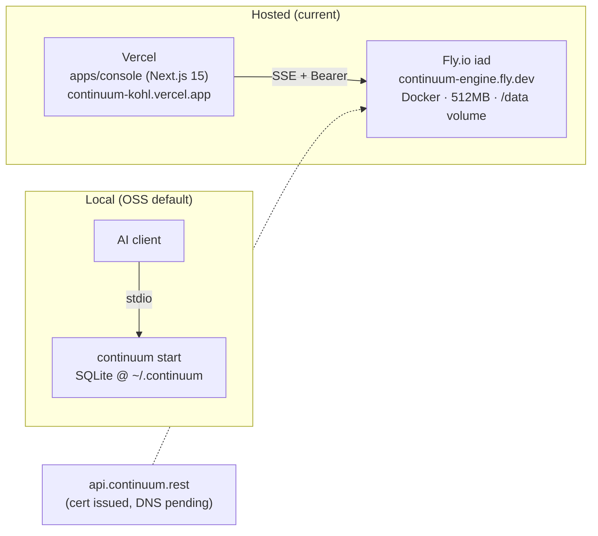

<!--
  PROJECT_HANDOVER.md
  Generated 2026-06-12 by Claude (Opus 4.8, 1M context) per the
  Model Handover Document Specification (System-Spec.md).

  Audience: a future, more capable model that will reconstruct/extend
  this architecture, AND the weaker models that will later execute the
  revised plan step-by-step.

  Discipline: every factual claim below was verified against the code,
  git history, deployed endpoints, or the append-only checkpoint ledger
  at generation time — NOT asserted from memory (per AGENTS.md P4 / the
  repo's partner-agreement clause #1 "verify before assertion"). Where a
  claim could NOT be verified, it is explicitly flagged as ⚠️ UNVERIFIED
  or ASPIRATIONAL. Trust nothing here you can re-derive — re-derive it.
-->

# CONTINUUM — Project Handover Document

> **Snapshot:** `main` @ `3531c6f` · 2026-06-12 · architecture map v0.3 ·
> product line V1.2 (Multi-Tenant Native Scaling, Sprint W27 closed).
> Apache-2.0 · `github.com/number7even/CONTINUUM` (currently **private**).

---

## 1. Executive Summary

**Continuum** is a *persistent intelligence layer* for AI coding assistants,
delivered as a **Model Context Protocol (MCP) server**. It solves the
"AI-collaborator memory problem": the cycle where a developer loses hours every
session re-explaining project history because the AI assistant (Claude Code,
Cursor, Claude Desktop, Cline) starts every session cold. Continuum aggregates
**five sources of project truth** — `/docs` (RAG), AI memory observations
(claude-mem-compatible), HITL feedback signals (SONA-style rewards), git
history, and AI session transcripts — and produces three artifacts: (1)
immutable, hash-sealed, timestamped `product_state[]` checkpoints
(*"what was true on May 14?"* → verifiable answer); (2) auto-generated
session-start briefings so the AI opens warm; (3) a live todo pipeline tracking
commitments from discussion → action → verification. The 5-source aggregation
is the defensible moat — no competitor (claude-mem = observations only, Mem.ai =
notes, Notion = docs, Cursor rules = conventions) checkpoints *state*.

**Business domain:** developer tooling / AI infrastructure, with a deliberate
three-customer ladder sharing **one engine, configuration-only differences**:
(1) *dogfood* — the VoiceCosmos dev team (shipped); (2) *AI-assisted builders* —
open-source + hosted SaaS for solo founders and small teams (the imminent
launch target); (3) *VoiceCosmos hotel tenants* — the same engine tenant-scoped
and embedded in the "ARIA" hospitality Voice OS (V3). **Maturity stage:** past
prototype, past MVP — a **working, production-deployed V1.2** (multi-tenant,
filesystem-isolated, 120/120 tests green, two live public endpoints) that is
**not yet publicly launched** (npm packages unpublished, repo private,
governance docs missing). The single defining product principle, locked
2026-06-12: *"the only AI memory layer that refuses to mark work done until a
shell command proves it."* Verify-then-dissolve is the moat, not a feature.

**Key goals for the next iteration:** execute the **OSS-First V1 launch** on the
already-proven SQLite + RuVector stack (publish packages, flip repo public, add
governance + docs site, finalize one-line install), while holding the line
against premature integration (11 parked integration proposals must NOT enter
the shipping path ahead of their gated phase). The deeper architectural prize —
local-inference-grounded swarm recursion (RecursiveMAS) and unified RuVector
persistence — remains correctly deferred behind hard preconditions.

---

## 2. Full Project Scope

### 2.1 In-Scope Features

**Functional (shipped & verified at this snapshot):**

- **MCP tool surface (10 tools)** via `@modelcontextprotocol/sdk`:
  `continuum_record_checkpoint`, `continuum_get_state`, `continuum_get_digest`,
  `continuum_search_docs`, `continuum_get_todos`, `continuum_create_todo`,
  `continuum_update_todo`, `continuum_timeline`, `continuum_get_observations`,
  `continuum_delete_observation` (incident-response delete, Issue #10).
- **MCP Resources (4):** `continuum://todos/open`, `continuum://state/current`,
  `continuum://digest/latest`, `continuum://session/briefing` (Layer-0
  composite markdown brief).
- **MCP Prompts (2):** `continuum.session_start` (Layer-0→1→3 retrieval
  protocol), `continuum.cite` (Observation-ID citation discipline).
- **Progressive Disclosure 3-layer retrieval** (token-efficient deep recall;
  ~10x token savings claim originates in product narrative — see ⚠️ in §2.3).
- **Checkpoint engine:** append-only, hash-sealed `product_state[]` snapshots
  with `active[]` / `dormant[]` / `broken[]` feature classification, each entry
  carrying a re-runnable `verifyCommand` witness.
- **Live todo pipeline:** CRUD + state machine, surfaced to the AI as a
  Resource.
- **5-source adapter framework** (3 of 5 shipped): `docs` (idempotent `.md`/`.mdx`
  ingester, stable `sha256(relativePath)` IDs), `git` (one Observation/commit,
  40-char SHA as ID, diffs excluded by design), `export` (Claude session JSONL →
  Observation). `mem` (claude-mem) and `sona` adapters deferred to V0.5.
- **Cross-source FTS5 full-text search** over all aggregated observations.
- **CLI** (`continuum init / start / serve / status / import-state`): single bin;
  `init` scaffolds DB + prints MCP registration snippet (+ auto-imports STATE.md
  if present and no checkpoints exist); `start` execs stdio MCP server; `serve`
  execs HTTP/SSE server; `import-state` forces a STATE.md → checkpoint parse.
- **STATE.md → first-checkpoint parser** (pure string→struct, no I/O).
- **Privacy filter** — 11 named secret patterns that **actually scrub**
  (`[REDACTED:<label>]`), deep-scrubs `Observation.metadata` (Issue #8),
  operator-extensible via `$CONTINUUM_PRIVACY_CONFIG` JSON, optional
  Shannon-entropy detector (4.5 bits/char, gated).
- **HTTP/SSE transport (V1):** Express + `SSEServerTransport` + Bearer-token
  auth + per-session `buildServer(projectId)` instances + `/healthz`.
- **Multi-tenant native isolation (V1.2 / Sprint W27, Path A):** per-tenant
  filesystem isolation; `sanitiseTenantId` security gate; JWT tenant-claim
  routing + `X-Continuum-Project` header validation; `TenantRegistry` LRU cache
  with reference counting + idle eviction (memory-bounded); mechanical
  cross-tenant isolation proofs.
- **AaaS frontend:** `apps/console` Next.js 15 server-rendered page connecting
  to a live engine over SSE, rendering the live tool/resource/prompt registry.
  Deployed to Vercel.

**Non-functional (in scope):**

- **Performance:** read latency sub-millisecond (SQLite in-process);
  query p95 < 50 ms SLA (the W25 budget; verified 15.4 ms p95 even on the
  Dolt TCP probe).
- **Memory safety:** hard 512 MB Fly VM budget; CONTINUUM steady-state ~177 MB;
  TenantRegistry bounds tenant-backend count. **150 MB physical headroom is
  treated as binding law** (decision 2026-06-12).
- **Security/privacy:** strict `<private>` filter before any persistence;
  secret-scrubbing; tenant-ID sanitization gate; Bearer/JWT auth on HTTP;
  `npm audit` gate in CI with a documented per-CVE allowlist.
- **Zero-config promise** for solo OSS developers (local SQLite, no external
  services required in default config).
- **Verifiability:** every checkpoint entry must carry a shell `verifyCommand`
  that exits 0 before the entry is marked active (the core moat discipline).

### 2.2 Out-of-Scope / Deferred

- **Chroma vector store** — named in v0.3 ARCHITECTURE but **deferred**; V0
  ships SQLite + FTS5 **keyword-only**. Vector search arrives via the opt-in
  hybrid backend (V0.5).
- **RuVector as default storage** — opt-in stub only (`CONTINUUM_STORAGE_BACKEND=hybrid`);
  default-on migration, RRF hybrid FTS5+vector search, and bulk vector indexing
  are V0.5 follow-ups.
- **Local digest generation (ruv-FANN / ruvllm)** — V0.5; V0 uses a template
  fallback (no external-LLM dependency in default config).
- **Dolt (SQL data-versioning engine)** — **PARKED 2026-06-12.** Surgically
  probed (Scenario B: 1 process + 10 logical DBs passes all 4 budgets; Scenario
  A: 10 processes rejected on memory). Verdict: mechanically viable but the
  shipped SQLite+RuVector stack delivers identical isolation guarantees with
  zero added overhead, so Dolt is parked unless a future product trigger demands
  native data-versioning.
- **Worker-daemon architecture (port 37778, Bun-managed)** — ASPIRATIONAL in
  ARCHITECTURE.md §6; **NOT the shipped runtime** (see §3.1 divergence note).
- **Web UI / status dashboard** — V1.5.
- **Hosted multi-tenant SaaS** (OAuth, billing, team workspaces, Postgres
  control plane) — V2.
- **ARIA hotel integration** — V3.
- **11 parked integration proposals** (GitHub Issues #1–#7, #19, #22, etc.):
  DSPy.ts, Ruflo, RecursiveMAS, Mike, MidStream+Prime-Radiant, Agentic-Jujutsu,
  TaskmasterAI, RVM, GitReverse, H-MARA. **Tracked, not in the shipping path.**
  Partner-agreement clause #3 forbids landing integration #N ahead of its gate.

**Known trade-offs made to reach current state:**

- npm workspaces over pnpm (D3) — pnpm not installed; migration documented as
  trivial.
- SQLite-FTS5 keyword search shipped first over vector search — battle-tested,
  ships week 1; vector is the V0.5 swap behind the `StorageBackend` seam.
- Diffs excluded from git-adapter observations (token + privacy cost;
  recoverable via `git show <sha>`).
- Direct stdio/HTTP MCP server shipped instead of the heavier worker-over-HTTP
  design — simpler, but async-work-survives-session-boundary benefits of the
  worker model are not yet realized.

### 2.3 Success Criteria

- **Latency:** read sub-ms; query p95 < 50 ms (✅ met; 15.4 ms measured).
- **Memory:** steady-state within 512 MB VM with ≥150 MB headroom (✅ met).
- **Correctness gate:** 100% of checkpoint entries verify-green (exit 0) at
  stamp time (✅ — all 19 entries green at the V1 AaaS-LIVE stamp).
- **Test suite:** full workspace cascade green. ✅ **120/120 tests passing**:
  core 51, mcp-server 45, cli 5, adapter-git 7, adapter-docs 6, adapter-export 6.
- **Uptime:** both public endpoints return 200 (✅ at snapshot —
  `continuum-engine.fly.dev/healthz` and `continuum-kohl.vercel.app`).
- **Token efficiency:** ⚠️ The README claims "~10x token savings" from
  Progressive Disclosure. This is a **design-intent claim**, not an
  independently benchmarked figure in-repo. A future model should treat it as a
  hypothesis to validate, not a measured result.
- **Business KPIs (target, not yet measured):** OSS adoption (npm installs,
  GitHub stars post-public), conversion OSS→hosted SaaS (V2), and — the
  ultimate dogfood KPI — Continuum enabling the VoiceCosmos team to ship without
  re-explaining context each session.

---

## 3. Architecture Documentation

### 3.1 System Overview

Continuum is a **TypeScript monorepo** (npm workspaces, Node ≥20). The runtime
is an MCP server exposing tools/resources/prompts to any MCP-aware AI client,
backed by a pluggable `StorageBackend` (SQLite default; hybrid SQLite+RuVector
opt-in). Source adapters normalize external truth into canonical `Observation`
rows; the checkpoint engine seals `product_state[]` snapshots.

```mermaid
flowchart TD
    subgraph Clients["AI Clients (MCP-aware)"]
        CC["Claude Code / Desktop / Cursor / Cline"]
    end

    subgraph Transport["MCP Transport"]
        STDIO["stdio (continuum start)"]
        HTTP["HTTP/SSE Express (continuum serve)<br/>Bearer + JWT tenant routing"]
    end

    subgraph Server["@continuum/mcp-server"]
        BUILD["buildServer(projectId)<br/>per-session / per-tenant"]
        TOOLS["10 Tools"]
        RES["4 Resources"]
        PROMPTS["2 Prompts"]
        REG["TenantRegistry<br/>LRU + refcount + idle evict"]
    end

    subgraph Core["@continuum/core"]
        AGG["Aggregator / Observation"]
        CKPT["Checkpoint engine<br/>(hash-sealed, append-only)"]
        TODO["Todo state machine"]
        PRIV["Privacy filter (scrub)"]
        FACT["openStorage() factory"]
    end

    subgraph Storage["StorageBackend (pluggable)"]
        SQLITE["SQLiteStorageBackend<br/>better-sqlite3 + FTS5 (default)"]
        HYBRID["HybridStorageBackend<br/>SQLite + RuVector HNSW + MiniLM<br/>(opt-in: CONTINUUM_STORAGE_BACKEND=hybrid)"]
    end

    subgraph Adapters["Source Adapters (3 of 5)"]
        DOCS["docs (.md/.mdx)"]
        GIT["git (1 obs/commit)"]
        EXPORT["export (Claude JSONL)"]
        MEM["mem — V0.5"]
        SONA["sona — V0.5"]
    end

    CC --> STDIO --> BUILD
    CC --> HTTP --> REG --> BUILD
    BUILD --> TOOLS & RES & PROMPTS
    TOOLS --> AGG & CKPT & TODO
    AGG --> PRIV --> FACT
    FACT --> SQLITE & HYBRID
    DOCS & GIT & EXPORT --> AGG
    MEM -.V0.5.-> AGG
    SONA -.V0.5.-> AGG
    SQLITE & HYBRID --> DISK[("~/.continuum/{project}<br/>or /data on Fly")]
```

**Deployment topology:**



- **Environments:** local dev (stdio) · hosted engine (Fly.io, always-on,
  persistent volume) · frontend (Vercel). Region: `iad` (US East).
- **⚠️ Architecture divergence note (critical for a redesigning model):**
  `ARCHITECTURE.md §6` describes a **Worker Service on `localhost:37778`,
  Bun-managed, with a thin stdio adapter routing over HTTP**. The **shipped
  code does NOT implement this** — it ships a direct stdio MCP server
  (`continuum start`) and a separate Express HTTP/SSE server (`continuum
  serve`). The worker-daemon model (async source polling, embedding queue,
  digest scheduler surviving session boundaries) remains a design aspiration.
  Reconcile the doc with reality before building on §6.

### 3.2 Component Breakdown

| Component | Path | Purpose | Key tech / deps |
|---|---|---|---|
| **`@continuum/core`** | `packages/core` | Types, DB, checkpoint engine, todo CRUD, storage abstraction + factory, privacy filter, STATE.md parser, embedder, Byzantine-vote (swarm), tenant helpers | `better-sqlite3` (FTS5), `ruvector@0.2.25` (hybrid), `@xenova/transformers` (MiniLM-L6-v2, 384-dim) |
| **`@continuum/mcp-server`** | `packages/mcp-server` | MCP server: 10 tools, 4 resources, 2 prompts; stdio (`index.ts`) + factory (`server.ts`) + HTTP/SSE (`http.ts`); auth, briefing composer, TenantRegistry | `@modelcontextprotocol/sdk`, `express` |
| **`@continuum/cli`** | `packages/cli` | Single `continuum` bin: `init / start / serve / status / import-state`; hand-rolled argv | Node, `@continuum/core`, `@continuum/mcp-server` |
| **`@continuum/adapter-docs`** | `packages/adapters/docs` | Idempotent `.md`/`.mdx` ingester; `sha256(relativePath)` → UUID-shape stable ID | `@continuum/core` |
| **`@continuum/adapter-git`** | `packages/adapters/git` | One Observation/commit; 40-char SHA ID; `git log -z` `\x1f`-delimited parse | `@continuum/core` |
| **`@continuum/adapter-export`** | `packages/adapters/export` | Claude session JSONL → Observation | `@continuum/core` |
| **`apps/console`** | `apps/console` | Next.js 15 AaaS frontend; SSE client to live engine; renders registry | Next.js 15, `@modelcontextprotocol/sdk` (`SSEClientTransport`) |

**Storage abstraction (the load-bearing seam — D2):**

```typescript
// packages/core/src/storage.ts — the interface all consumers go through.
export interface StorageBackend {
  // checkpoint, observation, todo, FTS5 search operations …
  upsertObservation(obs: Observation): void;     // idempotent adapter re-sync
  deleteObservation(id: string): void;           // incident response (Issue #10)
  // …
}

// packages/core/src/factory.ts — the single swap point.
//   default            → SQLiteStorageBackend (better-sqlite3 + FTS5)
//   STORAGE_BACKEND=hybrid → HybridStorageBackend (SQLite + RuVector HNSW + MiniLM)
export function openStorage(projectId: string): StorageBackend { /* … */ }
```

The V0.5 RuVector migration is a **single-line change at `openStorage()`** — all
consumers (`mcp-server`, `adapter-*`) are insulated. This seam is the reason the
project can ship SQLite now and swap engines later without a rewrite.

**API contract (MCP — not REST/OpenAPI):** the public contract is the MCP
tool/resource/prompt schema, defined in `packages/mcp-server/src/tools/*.ts`,
`resources/*.ts`, `prompts/*.ts`. The one HTTP surface that is *not* MCP-framed
is `GET /healthz` (load-balancer probe, auth-exempt). Tool registration snippet
for a client:

```jsonc
// .mcp.json  (per-project) — see .mcp.json.example
{
  "mcpServers": {
    "continuum": {
      "command": "node",
      "args": [".../packages/mcp-server/dist/index.js"],
      "env": { "CONTINUUM_PROJECT_ID": "your-project" }
    }
  }
}
```

**Data schema (canonical `Observation`):** an aggregated row carrying `id`
(stable, source-derived), `type` (e.g. `commit`, `agent_handoff`), `project`,
`content` (privacy-scrubbed), `metadata` (deep-scrubbed), timestamps, and a
content hash. Checkpoints store `product_state[]` with `active[]`/`dormant[]`/
`broken[]` arrays, each entry carrying a `verifyCommand`. FTS5 virtual tables
index `content` across all sources for cross-source search.

### 3.3 Infrastructure & DevOps

- **CI/CD:** GitHub Actions `.github/workflows/ci.yml` — triggers on push/PR to
  `main` + `workflow_dispatch`; concurrency group cancels in-flight runs on the
  same ref. Steps: `npm ci --ignore-scripts` → **`npm run audit`** (audit-ci
  gate, `--audit-level=high`, per-CVE allowlist in `.audit-ci.jsonc`) →
  informational `npm audit` → `npm rebuild better-sqlite3` → per-workspace build
  in dep order → `npm test` (`node --test dist/` per workspace). Node 20 matrix.
  `apps/console` build is excluded (Vercel owns it).
- **Containerization:** repo-root `Dockerfile` (node:20-bookworm-slim base per CI
  comment) + `entrypoint.sh`; `.dockerignore`. Builds the HTTP/SSE engine.
- **IaC:** `fly.toml` — app `continuum-engine`, region `iad`, `shared-cpu-1x`
  512 MB, persistent `continuum_data` volume at `/data`, always-on
  (`auto_stop_machines = off`, `min_machines_running = 1`), `/healthz` check.
  No Terraform/K8s — single-VM Fly deploy + Vercel.
- **Environment config (15+ `CONTINUUM_*` vars):** `CONTINUUM_PROJECT_ID`,
  `CONTINUUM_DATA_DIR`, `CONTINUUM_HTTP_PORT` (7878 on Fly), `CONTINUUM_HTTP_TOKEN`
  (Bearer secret, via `fly secrets set`), `CONTINUUM_STORAGE_BACKEND`
  (`sqlite`|`hybrid`), `CONTINUUM_EMBEDDING_MODEL`, `CONTINUUM_EMBED_WORKERS`,
  `CONTINUUM_BRIEFING_WINDOW_HOURS`, `CONTINUUM_MAX_OPEN_TENANTS`,
  `CONTINUUM_TENANT_IDLE_TIMEOUT_MS`, `CONTINUUM_JWT_ISSUER`,
  `CONTINUUM_JWT_AUDIENCE`, `CONTINUUM_JWT_TENANT_CLAIM`,
  `CONTINUUM_PRIVACY_CONFIG`, `CONTINUUM_PRIVACY_ENTROPY_DETECTOR`.
  Prod differs from dev only by these (the three-customer "config-only" promise).

### 3.4 Security & Compliance

- **AuthN/AuthZ:** local stdio = trust the host. HTTP/SSE = **Bearer token**
  (`CONTINUUM_HTTP_TOKEN`) + optional **JWT tenant-claim routing**
  (`CONTINUUM_JWT_*`) with `X-Continuum-Project` header validation. Tenant IDs
  pass a `sanitiseTenantId` gate (case-folded canonical identity normalization
  — closes a header-spoofing bypass).
- **Tenant isolation (V1.2, Path A):** per-tenant filesystem directories;
  mechanical cross-tenant isolation proofs across three orthogonal layers;
  `du -sh` / `rm -rf` isolation guarantees (delete one tenant dir, the other
  nine survive and the deleted tenant is unrecoverable).
- **Encryption:** TLS via Fly `force_https`; secrets via `fly secrets` (encrypted
  at rest on Fly), never in `fly.toml [env]`. ⚠️ No application-level
  data-at-rest encryption of the SQLite file itself (host-disk trust model).
- **Privacy filter (§8 invariant):** enforced inside
  `observation.ts:insertObservation` (NOT a separate Aggregator module — a
  CTO-doc correction). 11 secret patterns scrub to `[REDACTED:<label>]`; deep
  metadata scrub; operator-extensible; optional entropy detector.
- **Audit:** append-only checkpoint ledger is itself the audit chain (hash-sealed,
  tamper-evident). `npm audit` gated in CI.
- **Compliance:** ⚠️ No formal GDPR/HIPAA/SOC2 program exists. The privacy
  filter + local-first storage are *enabling primitives*, not certification.
  The "court-admissible citations" claim belongs to a parked integration (Mike,
  Issue #4) and requires legal counsel sign-off before being asserted.
- **Governance gap:** `SECURITY.md` and `CODE_OF_CONDUCT.md` are **missing**
  (must land before public launch). `LICENSE` (Apache-2.0), `CONTRIBUTING.md`,
  and `AGENTS.md` (The Nine agent discipline, schema v0.1.0) are present.

---

## 4. Git Repository Status

### 4.1 Repository Structure

**Monorepo** (npm workspaces). Root layout:

```
CONTINUUM/
├── README.md ARCHITECTURE.md AGENTS.md CLAUDE.md CONTRIBUTING.md LICENSE
├── Dockerfile entrypoint.sh fly.toml .dockerignore
├── .mcp.json.example  .audit-ci.jsonc  tsconfig*.json
├── package.json (workspaces: packages/*, packages/adapters/*, apps/*)
├── packages/
│   ├── core/         ← types, db, checkpoint, todo, storage(+hybrid), privacy, state-md, tenant, embedder
│   ├── mcp-server/   ← tools/ resources/ prompts/ + index(stdio) + server(factory) + http(SSE) + auth + tenant-registry
│   ├── cli/          ← single `continuum` bin
│   └── adapters/{docs,git,export}/   ← (mem, sona = V0.5; .gitkeep placeholder)
├── apps/console/     ← Next.js 15 AaaS frontend (Vercel)
├── dolt-probe/       ← disposable Dolt probe (PARKED; Dockerfile + 3 probe scripts + fly.toml)
├── scripts/          ← checkpoints/ + smoke tests (privacy, ruvector, http, burst, isolation, throughput)
├── docs/             ← HOW_CONTINUUM_WORKS, DEPLOY_FLY, DEPLOY_SELF_HOSTED, CTO_ANALYSIS, sprint docs, UX-JOURNEYS …
│   └── H-MARA-CONTINUUM/  ← ⚠️ untracked research PDFs (H-MARA integration study); NOT part of the build
└── tests/  CI/  .github/  .codegraph/
```

### 4.2 Branch Strategy

- **Active branches:** `main` only (local + `origin/main` in sync at `3531c6f`).
  No `develop`, no open feature branches at snapshot.
- **Convention:** `feature/<name>`, `fix/<name>`; **PR required** (per
  `CLAUDE.md` repo conventions).
- **Commits:** **Conventional Commits** (`feat`, `fix`, `docs`, `chore`,
  `refactor`, `test`, `perf`) — strictly observed (see history below).
- **Tags/releases:** **none yet** (`git tag` empty) — consistent with
  pre-release, rapid-iteration phase. ⚠️ A redesigning model should institute
  semver tags at the OSS launch.
- **Decision-lock ritual:** architectural decisions are locked in
  `ARCHITECTURE.md §14` (`pending` → `✅ Locked YYYY-MM-DD`) in the same PR.

### 4.3 Commit History Snapshot

Most recent 20 (newest first), `main`:

```
3531c6f chore(probe): Dolt Scenario B audit — Path A passes 3/4; verdict math correction
4487f14 chore(probe): W27→V1.x · Dolt surgical probe artifacts + findings
c90ef54 chore(checkpoint): stamp aaa719e4 — SPRINT-W27 CLOSED · V1.2 multi-tenant locked
35256b5 feat(W27): W27-5 TenantRegistry LRU cache + idle eviction (mem-safety)
d6a8746 feat(W27): W27-4 mechanical cross-tenant isolation proofs (3 + 4)
cda7bd2 feat(W27): W27-3 JWT tenant-claim routing + X-Continuum-Project validation
8d40f3e feat(W27): W27-1 sanitiseTenantId gate + W27-2 buildServer(tenantId) factory
a40a991 docs(sprint): stage SPRINT-W27 — V1.2 multi-tenant (Path A · filesystem-isolated)
1d5d288 chore(checkpoint): stamp 5670d816 — SPRINT-W26 CLOSED · V1 Swarm Aggregation locked
e0d230f feat(W26): docs mesh swarm + export hierarchical swarm — BFT in action
fd5137f feat(W26): decoupled BFT + git ring swarm — Path C executed
add2d11 feat(adapters): W26-1 · land ruv-swarm dep + Journey 3 probe (no regression)
6a7ab0b docs(sprint): stage SPRINT-2026-W26 — V1 swarm aggregation (ruv-swarm)
67d2b9f chore(checkpoint): stamp 83faa040 — SPRINT-W25 CLOSED · V0.5 throughput hardened
c9ddd92 perf(storage-hybrid): W25-1 · T4 + T6 — quiet timer 50→200ms + ruvector insertBatch
227e5e8 perf(storage-hybrid): W25-1 · T1 EMBED_BATCH_SIZE 32→128
c1f14b5 docs(sprint): stage SPRINT-2026-W25 — V0.5 ingestion throughput hardening
0e3a149 chore(checkpoint): stamp e3bd67a4 — SPRINT-W24 CLOSED · OSS Docker baseline locked
625de71 test(core): W24-5 · cross-source FTS5 canary fixture closes Issue #18
3b02129 ci(audit): W24-4 recovery · Path B — audit-ci allowlist with per-CVE rationale
```

**Milestones reached** (product-line markers, via checkpoint ledger — 16 canonical
append-only snapshots V0→V1.2):

| Marker | Date | What |
|---|---|---|
| V0 born | 2026-05-14 | First `product_state[]` checkpoint |
| V0 polish complete | 2026-05-24 | Resources/Prompts/CLI/adapters/STATE-parser/privacy all shipped |
| V0.5 hybrid stub | 2026-05-24 | `HybridStorageBackend` opt-in |
| V1 HTTP/SSE stub | 2026-05-24 | Express SSE + Bearer + AaaS scaffold |
| **V1 AaaS LIVE** | 2026-05-28 | Live Fly engine + Vercel frontend + public SSE roundtrip verified |
| SPRINT-W26 closed | 2026-06-07 | V1 swarm aggregation (ruv-swarm, BFT) |
| **SPRINT-W27 closed** | 2026-06-09 | **V1.2 Multi-Tenant Native Scaling locked** (current line) |

**Known "problematic" commits (kept by append-only invariant, not bugs in `main`):**
checkpoint drafts `a63eb576`, `c6291935` carry broken `verify_commands` and
pre-fix hashes — retained deliberately in the DB ledger as the iteration log.

### 4.4 Open Work

- **Unmerged PRs:** none open.
- **Open GitHub issues (11, all integration proposals or triage):**
  #22 H-MARA [v2], #21 GitReverse [v0.5+], #19 RVM [v0.5+], #17 triage #1–#7
  [chore], #7 TaskmasterAI [v0.4], #6 Agentic-Jujutsu [v1+], #5 MidStream+Prime
  Radiant [v1.x], #4 Mike [v2], #3 RecursiveMAS [v1.5+], #2 Ruflo [v1+],
  #1 DSPy.ts [v0.4]. **None are launch-blocking; all gated.** 11 issues closed
  total.
- **Tier-A defect backlog (close before V0.5 — from Issues #8–#20 captured
  2026-05-24):** #8 (privacy metadata scrub) — **CLOSED**; #9 (CLI project-id
  case-sensitivity foot-gun) — open; #10 (`deleteObservation` incident
  response) — shipped. Tier B (sustainability): #11 `node --test` framework —
  done; #12 mcp-server split — partially done; #13 `continuum verify` CLI — open.
- **Launch-readiness gaps (inventory 2026-06-12, Obs 3289):** npm packages
  `@continuum/core|cli|mcp-server` **unpublished** (all E404); repo **private**;
  `SECURITY.md` + `CODE_OF_CONDUCT.md` **missing**; **no docs-site framework**;
  one-line install flow not finalized.
- **Code TODOs:** ⚠️ not exhaustively swept for this document. Run
  `grep -rn "TODO\|FIXME\|XXX" packages apps --include=*.ts` before relying on
  "no TODOs."

---

## 5. Development Roadmap

### 5.1 Completed Work

- **V0** (2026-05-14): dogfood-ready MCP server, `export` adapter, SQLite+FTS5,
  `StorageBackend` abstraction.
- **V0 polish** (2026-05-24, closed): 4 Resources, 2 Prompts, `agent_handoff`
  observation kind, `docs`+`git` adapters, CLI, STATE.md parser, privacy filter
  expansion (4→11 patterns, actual scrubbing).
- **V0.5 stub** (2026-05-24): `HybridStorageBackend` (SQLite + RuVector + MiniLM),
  opt-in; throughput hardening (W25).
- **V1** (2026-05-28, AaaS LIVE): HTTP/SSE transport, Bearer auth, Next.js
  console, live Fly + Vercel deploy, public SSE roundtrip verified; swarm
  aggregation (W26, ruv-swarm + Byzantine vote).
- **V1.2** (2026-06-09, current): Multi-Tenant Native Scaling (Path A) — 5
  deliverables (tenant sanitization gate, per-tenant factory, JWT routing,
  isolation proofs, TenantRegistry LRU).
- **Technical debt addressed:** mcp-server split into `index/server/http`
  (Issue #12 partial); `node --test` standardized (Issue #11); CI audit gate
  recovered via allowlist (W24-4); cross-source FTS5 canary fixture (Issue #18);
  privacy metadata scrub (Issue #8).

### 5.2 Immediate Next Steps (Next 30–60 days) — OSS-First V1 Launch

Strategy **locked 2026-06-12 (Obs 3288):** ship the proven V1.2 SQLite+RuVector
stack as the OSS launch; do NOT chase Dolt or premature integrations. Priorities:

1. **Publish npm packages** (`@continuum/core`, `@continuum/cli`,
   `@continuum/mcp-server`) — currently E404. *Rationale:* the one-line install
   promise is the adoption gate. *Blocker:* finalize `bin`/`files`/`exports`
   fields + a `prepublishOnly` build; decide public scope vs unscoped name.
2. **Flip GitHub repo public** + add **`SECURITY.md`** and
   **`CODE_OF_CONDUCT.md`**. *Rationale:* OSS credibility + responsible-disclosure
   path. *Effort:* small. *Dependency:* a secret-scan of full history first.
3. **Finalize one-line install + `continuum init` UX** (close Issue #9 CLI
   project-id case-sensitivity foot-gun; add `continuum verify` Issue #13).
   *Rationale:* first-run experience is the conversion moment.
4. **Stand up a docs site** (no framework chosen yet — Astro/Nextra/Docusaurus).
   *Rationale:* the README narrative outruns discoverable docs.
5. **Rewrite the core narrative** around the locked tagline — *"the only AI
   memory layer that refuses to mark work done until a shell command proves
   it"* — and define the **OSS vs SaaS boundary** (OSS = local SQLite + shell
   exit-code verifiers; V2 SaaS = hosted multi-tenant RuVector + JWT +
   HTTP/Playwright verifiers).

*Effort note:* these are mostly "boring infrastructure" (packaging, governance,
docs) — deliberately, because the future SaaS tier depends on them being solid.

### 5.3 Long-Term Vision (6–12 months)

- **V0.5 (next major phase):** RuVector becomes default (gated on RuVector v1.0+
  maturity + a benchmark beating the SQLite-FTS5 baseline); `claude-mem` + `sona`
  adapters (5-of-5 source coverage); local digest generation (ruv-FANN OR
  ruvllm); RVF COW snapshots replace JSON checkpoints.
- **V1.5:** web UI; `continuum_spawn_swarm` MCP tool; OpenClaw Gateway
  distribution; Ruflo orchestration (#2); **RecursiveMAS latent-space recursion
  (#3) — hard-gated on `ruvllm` local inference shipping** (cloud APIs don't
  expose hidden states, so RecursiveLink is incoherent against
  Anthropic/OpenAI/Google APIs).
- **V2:** hosted SaaS — RuVector native multi-tenant collections + Postgres
  control plane (resolves the open D-V2.2 tenancy flag), OAuth, billing, team
  workspaces; Mike legal addon (#4, counsel sign-off required).
- **V3:** ARIA hotel integration — same engine, tenant-scoped, embedded in the
  Voice OS.
- **Scaling targets (probe-derived):** current per-tenant cost supports ~40
  additional tenants on a single `shared-cpu-1x` 512 MB VM before tuning;
  TenantRegistry bounds memory; horizontal scale is the V2 fleet story.

---

## 6. Known Issues & Risks

### 6.1 Technical Debt

- **ARCHITECTURE.md §6 ↔ shipped runtime divergence** (worker-daemon vs direct
  stdio/HTTP) — the single highest-value doc-vs-code reconciliation.
- **Chroma referenced but never shipped** — docs/diagrams still mention it; V0 is
  FTS5-only. Vector path lives in the opt-in hybrid backend.
- **`apps/console` excluded from CI** — no test gate on the frontend (Vercel
  owns its build).
- **No semver tags / release process** — every artifact is "latest `main`."
- **npm-audit allowlist** silences a 9-advisory protobufjs chain with documented
  rationale — must be re-reviewed as deps move.

### 6.2 Bugs & Edge Cases

- **Issue #9** — CLI project-id case-sensitivity foot-gun (two casings → two DBs).
- **File-handle lifecycle on delete** — server must be stopped before `rm -rf` of
  a tenant/database directory (same constraint surfaced in the Dolt probe and
  the SQLite W22 delete-observation work). A live `deleteObservation`/tenant
  delete while the process holds handles is the edge case to guard.
- **Privacy filter is pattern + optional-entropy based** — it will not catch
  novel secret formats; entropy detector is off by default. Assume best-effort,
  not exhaustive.

### 6.3 Operational Risks

- **Single points of failure:** one Fly machine (`min_machines_running = 1`,
  always-on, single region `iad`); one Vercel frontend; one persistent volume.
  No multi-region, no replica.
- **Monitoring gaps:** only `/healthz` (Fly) + `/healthz` exposes TenantRegistry
  stats + process memory. **No external dashboards/alerting** (no Grafana/
  Datadog/CloudWatch wired). An outage is invisible until a probe hits 200≠.
- **RTO/RPO:** ⚠️ undefined. Recovery = redeploy from `main` + Fly volume.
  **The Fly volume is the only copy of hosted state** — no documented backup/
  snapshot cadence. Losing the volume loses hosted observations/checkpoints. A
  redesigning model should define RPO and add volume snapshots before SaaS.
- **Custom domain:** `api.continuum.rest` cert issued but **DNS pending** — the
  stable public hostname isn't live; consumers hit `continuum-engine.fly.dev`.

---

## 7. Operational Runbook

### 7.1 How to Deploy

**Local (OSS / dogfood):**
```bash
git clone https://github.com/number7even/CONTINUUM.git && cd CONTINUUM
npm install
npm rebuild better-sqlite3 --workspace=@continuum/core   # native addon
npm run build
# register with your AI client:
cp .mcp.json.example /path/to/your-project/.mcp.json      # edit CONTINUUM_PROJECT_ID + abs path
# then in the project:
node packages/cli/dist/index.js init      # scaffolds ~/.continuum/{project}, imports STATE.md if present
node packages/cli/dist/index.js start     # stdio MCP server (or: serve = HTTP/SSE)
```

**Hosted engine (Fly.io):**
```bash
fly secrets set CONTINUUM_HTTP_TOKEN=<strong-random>   # NEVER put this in fly.toml
fly deploy                                             # builds repo-root Dockerfile
fly status && curl -fsSL https://continuum-engine.fly.dev/healthz   # expect 200
# custom domain (cert already issued; finish DNS):
fly certs add api.continuum.rest   # then CNAME api.continuum.rest → continuum-engine.fly.dev
```

**Frontend (Vercel):** Root Directory = `apps/console`; set `CONTINUUM_HTTP_URL`
+ `CONTINUUM_HTTP_TOKEN` env vars; deploy. See `docs/DEPLOY_FLY.md` and
`docs/DEPLOY_SELF_HOSTED.md` for full walkthroughs.

**Rollback:** Fly keeps prior releases — `fly releases` then
`fly deploy --image <previous>` (or `fly releases rollback`). Vercel: redeploy a
prior deployment from the dashboard. Code: `git revert` on `main` (append-only
discipline — prefer revert over force-push).

### 7.2 How to Monitor

- **Primary signal:** `GET /healthz` on the Fly engine → 200 + JSON
  (TenantRegistry stats + process memory). The Vercel page returning 200 is the
  end-to-end signal.
- **Memory law:** keep steady-state RSS within 512 MB with ≥150 MB headroom
  (~177 MB CONTINUUM baseline measured). If hybrid backend is enabled, bump the
  VM to 1024 MB (MiniLM + ruvector load).
- ⚠️ **No alerting configured** — add an uptime probe + a memory alert before
  relying on the hosted engine for anything load-bearing.

### 7.3 How to Troubleshoot

| Symptom | Likely cause | Action |
|---|---|---|
| Fly VM won't start / "machine getting replaced" | seen during dolt-probe; transient Fly scheduling | re-check `fly status`; the machine often starts despite the error |
| 401 on `/sse` | missing/wrong Bearer token | confirm `CONTINUUM_HTTP_TOKEN` secret matches client `Authorization: Bearer` |
| Wrong/empty tenant data | project-id casing (Issue #9) or spoofed header | verify `X-Continuum-Project` + `sanitiseTenantId` canonicalization |
| `better-sqlite3` load error | native addon not built for the Node ABI | `npm rebuild better-sqlite3 --workspace=@continuum/core` |
| State wiped on restart (Fly) | missing/detached `/data` volume | confirm `[mounts]` volume `continuum_data` is attached |
| Stale tool list in console | engine restarted / SSE dropped | reload; the Server Component re-`listTools` on render |

**Debug commands:** `fly logs`, `fly ssh console`; local smoke tests in
`scripts/` (`privacy-smoke.mjs`, `ruvector-smoke.mjs`, `http-smoke.mjs`,
`verify-w27-isolation.mjs`, `burst-test-w27-5.mjs`). **Escalation path:** single
maintainer (Riaan Kleynhans) — no on-call rotation.

---

## 8. Credentials & Access

> ⚠️ **No secret values appear in this document, and none should ever.** This
> section is a *map of where secrets live*, per AGENTS.md P1 (minimize the
> secret).

| System | Access / role | Where the secret lives | Rotation |
|---|---|---|---|
| Fly.io (`continuum-engine`) | deploy/admin | Fly account; `CONTINUUM_HTTP_TOKEN` via `fly secrets set` (encrypted) | `fly secrets set` new token → redeploy; update Vercel env |
| Vercel (`apps/console`) | deploy/admin | Vercel project env vars (`CONTINUUM_HTTP_URL`, `CONTINUUM_HTTP_TOKEN`) | rotate in Project Settings; must match Fly token |
| GitHub (`number7even/CONTINUUM`) | owner | GitHub account (repo currently private) | standard GitHub token/key rotation |
| npm (`@continuum/*`) | publish (pending) | npm account / `NPM_TOKEN` (not yet configured) | set up before first publish |
| Local engine | host user | `CONTINUUM_HTTP_TOKEN` via `~/.continuum/bridge.env`; `CONTINUUM_PRIVACY_CONFIG` at `~/.continuum/privacy.json` | rotate local env files |

JWT issuer/audience/claim are configured via `CONTINUUM_JWT_*` env vars (no
embedded keys in repo). **No `.env` files are committed** (`.gitignore` enforced).

---

## 9. AI Model Context

### 9.1 Current Model

- **Authoring/dev model:** Claude (Opus 4.8, 1M-context) drives development; the
  repo is governed by **AGENTS.md ("The Nine," schema v0.1.0)** — a formal agent
  discipline (P1–P9: minimize the secret, prove don't grant, architect for
  change, **never claim more than you can verify**, the rule binds its keeper, be
  safely endable, free entry, no coercion, the trust-leap is the human's). Memory
  observations are generated by `claude-haiku-4-5` (the claude-mem summarizer).
- **Capabilities/limitations observed:** the **memory problem is the founding
  pain** — models start cold every session. Continuum itself is the structural
  counter-measure (session-start briefing + checkpoint ledger). The **partner
  agreement** (4 clauses) is the lived-practice expression of The Nine: (1)
  verify before assertion; (2) no silent overrides; (3) code > architecture
  revision (don't add integration #N while V0 ships zero code); (4) honor stop
  signals.
- **Prompt patterns that work well:** the `continuum.session_start` prompt
  (Layer-0 briefing → Layer-1 search → Layer-3 fetch); `continuum.cite`
  (Observation-ID citation discipline); progressive disclosure to avoid dumping
  raw memory into context.

### 9.2 Target Model Requirements

- **Expected improvements a stronger model should exploit:** larger context to
  hold the full checkpoint ledger + architecture in-session; better long-horizon
  planning to keep the parked-integration discipline; stronger code reasoning to
  execute the V0.5 RuVector swap behind the `openStorage()` seam without
  consumer churn.
- **Migration considerations:** the MCP tool/resource/prompt contract is the
  stable interface — model swaps should not require rewriting it. The
  **RecursiveMAS line (#3) hard-requires a local inference engine (`ruvllm`)**
  exposing hidden states; **cloud API models (Anthropic/OpenAI/Google) cannot
  satisfy it** — a target model running only behind a cloud API must treat
  latent-space recursion as out of reach until V0.5 local inference lands.
- **Backward compatibility:** append-only checkpoint invariant must hold across
  model generations — never rewrite history; add, don't mutate. Honor the
  hash-seal so old checkpoints remain verifiable.

### 9.3 Voice AI Specifics

⚠️ **Continuum itself is NOT a voice AI** — it is the memory/state engine. The
voice surface belongs to **customer #3 (VoiceCosmos "ARIA," V3)**, where a
Continuum instance is pointed at a hotel's data so the Voice OS "knows the
property." STT/TTS providers, voice-biometric integration (the README/CLAUDE
ecosystem references VoiceIDVault-class systems), and real-time streaming
latency targets are **ARIA/VoiceCosmos concerns, not in this repo at this
snapshot.** A model extending toward V3 should treat voice as a downstream
consumer of the same tenant-scoped engine, not a Continuum-core feature. Do not
invent voice specs here that the code doesn't have.

---

## 10. Appendices

**In-repo documents (source of truth — read before extending):**

- `ARCHITECTURE.md` — engineering source-of-truth; **§14 Open Decisions** (8/9
  locked), §15 Roadmap & 4-step phased plan, §10a (ruv-FANN), §10b (RuVector).
- `AGENTS.md` — The Nine agent binding (schema v0.1.0). Read first.
- `CLAUDE.md` — session-start onboarding + partner agreement + "what's true RIGHT
  NOW / what's NOT done" ledger.
- `README.md` — product narrative + 5-step terminal walkthrough.
- `docs/HOW_CONTINUUM_WORKS.md` — product + mechanics deep-dive.
- `docs/DEPLOY_FLY.md`, `docs/DEPLOY_SELF_HOSTED.md` — deployment walkthroughs.
- `docs/CTO_ANALYSIS_2026-05-20.md` — strategic analysis (incl. RecursiveMAS
  gating).
- `docs/INDEX.md` — documentation map. Sprint docs: W22–W27.
- `docs/UX-JOURNEYS.md`, `docs/UI-SKILLS.md`, `docs/V0.5-HYBRID.md`.
- ⚠️ `docs/H-MARA-CONTINUUM/` — untracked research PDFs (H-MARA integration
  study). Reference material for parked Issue #22, **not** part of the build.

**Decision log (ADRs):** `ARCHITECTURE.md §14` is the ADR table —
D0 (standalone repo) · D1 (name "Continuum", pending) · D2 (phased
SQLite-FTS5→RuVector) · D3 (npm workspaces) · D4 (phased digest engine) ·
D5 (Apache-2.0) · D6 (`number7even` org) · D7 (claude-mem as adapter) ·
D8 (checkpoint trigger = both). Open flag: **D-V2.2** (RuVector data plane +
Postgres control plane vs revert-to-Postgres) — must lock before V2.2.

**Live endpoints (verify with `curl`/probe before relying):**
- Engine: `https://continuum-engine.fly.dev` (`/healthz` → 200, `/sse` → 401
  unauth).
- Frontend: `https://continuum-kohl.vercel.app`.
- Pending: `https://api.continuum.rest` (cert issued, DNS not yet pointed).

**Reproducible checkpoint scripts:** `scripts/checkpoints/*.mjs` — each major
milestone has a re-runnable stamping script (e.g.
`v1-aaas-live-2026-05-28.mjs`).

**GitHub:** issues/PRs at `github.com/number7even/CONTINUUM/issues` (repo
currently private — access required).

---

> **Generated 2026-06-12 (Opus 4.8) under AGENTS.md / The Nine discipline.
> Every claim was verified against code, git, deployed endpoints, or the
> append-only ledger at generation time; unverifiable claims are flagged ⚠️.
> A future model should re-derive, not trust — the checkpoint ledger and the
> tests are the witnesses.**
>
> _IP by Riaan Kleynhans — Human in the Loop — Copyright Riaan Kleynhans._
