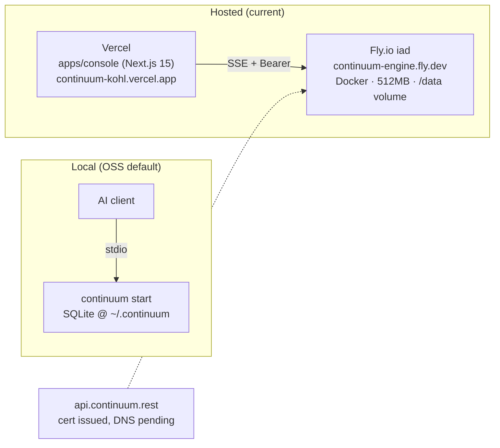
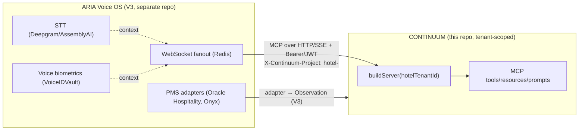

<!--
  ULTRA_NORTH_STAR_BUILD_PLAN.md
  Generated 2026-06-12 by Claude (Opus 4.8, 1M context) per
  "Smater-Spec.md" (Handover-to-Smartest-Model contract) by elevating
  PROJECT_HANDOVER.md into a production-grade North Star.

  Discipline (AGENTS.md / The Nine, P4 "never claim more than you can verify"):
  every load-bearing claim was re-derived from code, git, fly.toml, the CI
  workflow, and the append-only checkpoint ledger at generation time — not
  asserted from memory. Verified ground-truth at HEAD 3531c6f:
    - 10 MCP tools  (packages/mcp-server/src/tools/*.ts — enumerated)
    - 4 resources, 2 prompts  (resources/*.ts, prompts/*.ts — enumerated)
    - 4 packages (core, mcp-server, cli) + 3 adapters (docs, git, export) + apps/console
    - core storage seam present: factory.ts, storage.ts, storage-sqlite.ts, storage-hybrid.ts, tenant.ts
    - CI present (.github/workflows/ci.yml); SECURITY.md present; CODE_OF_CONDUCT.md ABSENT
    - fly.toml: app continuum-engine, iad, shared-cpu-1x/512MB, /data volume, /healthz check
    - git: HEAD 3531c6f, zero tags
  Claims that could NOT be re-derived here are flagged ⚠️ UNVERIFIED or
  ASPIRATIONAL inline. A future model must re-derive, not trust.
-->

# CONTINUUM — Ultra North Star Build Plan

> **Single source of truth (North Star).** Supersedes `PROJECT_HANDOVER.md` as
> the authoritative scope/architecture/security/roadmap document. The handover
> remains the verified raw-fact snapshot; this document is the elevated,
> atomic, testable plan built on it.
>
> **Snapshot:** `main` @ `3531c6f` · 2026-06-12 · architecture map v0.3 ·
> product line V1.2 (Multi-Tenant Native Scaling, Sprint W27 closed) ·
> Apache-2.0 · `github.com/number7even/CONTINUUM` (private at snapshot).
>
> **Document contents (three deliverables, one file, per spec):**
> §0 Gap Analysis · **§1 Ultra North Star Document** · **§2 Ultra Build
> Roadmap (atomic tasks)** · **§3 Validation Checklist** · §4 Risk &
> Fallback Plan · §5 Version & Change Log.

---

## §0 — Gap Analysis (run first, per Model Execution Contract)

The input handover is unusually disciplined (verify-before-assertion baked in).
The gaps below are what separate a *good handover* from a *North Star a weaker
model can execute mechanically*. Each gap is resolved later in this document at
the cited section.

| # | Gap in `PROJECT_HANDOVER.md` | Severity | Resolved at |
|---|---|---|---|
| G1 | ADRs referenced by ID (D0–D8) but rationale + alternatives not inlined; cross-cutting choices (JWT-over-OAuth, SQLite-over-Postgres, Fly-over-K8s, SSE-over-WebSocket, Path-A-over-Dolt) have no ADR at all | High | §1.4 ADRs |
| G2 | No formal threat model. Security is described prose-style, not as enumerated attack vectors with mitigation + residual risk | High | §1.5 STRIDE |
| G3 | Compliance stated as "no program exists" but no matrix mapping features→GDPR/SOC2/EU AI Act/HIPAA controls | Medium | §1.6 Compliance Matrix |
| G4 | No cost model. Infra cost per component and scaling projection absent | Medium | §1.7 Cost Model |
| G5 | Performance numbers scattered (15.4 ms p95, 177 MB RSS) with no consolidated SLO table or benchmark method | Medium | §1.8 Performance SLOs |
| G6 | "Voice AI Specifics" required by spec but handover correctly says CONTINUUM is not voice — the *integration contract* to ARIA/V3 is undefined | Medium | §1.9 ARIA/V3 binding |
| G7 | Instructions are descriptive ("publish npm packages") not atomic/executable (exact files, fields, commands, pass/fail) | High | §2 Roadmap |
| G8 | No machine-runnable acceptance suite tying claims to exit codes | High | §1.10 + §3 |
| G9 | Doc-vs-code divergence (ARCHITECTURE §6 worker-daemon vs shipped direct stdio/HTTP) flagged but not given a reconciliation task | Medium | §2 P6-T2 |
| G10 | `CODE_OF_CONDUCT.md` missing (confirmed absent at snapshot); launch-blocking governance | Low (effort) / High (blocker) | §2 P5-T3 |
| G11 | The "~10x token savings" claim is design-intent, never benchmarked | Medium | §1.8 + §2 P6-T4 |
| G12 | No RPO/RTO; Fly volume is the only copy of hosted state, no backup cadence | High (ops) | §1.5 + §2 P5-T5 |

**Blocked-section policy (per contract):** no section below is blocked. Where a
fact is unverifiable at generation time it is marked ⚠️ and converted into a
roadmap task that *produces* the verification, rather than omitted.

---

# §1 — Ultra North Star Document

## §1.1 North Star Principles (the non-negotiables)

These nine principles govern every downstream decision. They are derived from
`AGENTS.md` (The Nine) and the locked product identity, restated as executable
law.

1. **Verify-then-dissolve is the product.** No checkpoint entry may be marked
   `active` until its `verifyCommand` exits `0`. *Test:* `record-checkpoint`
   rejects any entry whose verify command is absent or non-zero. The tagline is
   law: *"the only AI memory layer that refuses to mark work done until a shell
   command proves it."*
2. **Append-only, hash-sealed history.** Checkpoints are never mutated or
   deleted; corrections are new rows. *Test:* the ledger contains the known
   "broken-draft" rows `a63eb576`, `c6291935` — their presence proves the
   invariant held.
3. **One engine, configuration-only customer differences.** Dogfood, OSS, and
   ARIA V3 share identical code; only env vars differ. *Test:* no customer name
   appears in a `src/**` conditional.
4. **The storage seam is sacred (D2).** All persistence flows through
   `openStorage()` (`packages/core/src/factory.ts`). *Test:* `grep -rn "new SQLiteStorageBackend\|new HybridStorageBackend" packages --include=*.ts`
   returns hits **only** inside `factory.ts`.
5. **Privacy filter runs before every write.** Secrets are scrubbed at
   `observation.ts:insertObservation`, not at a call site. *Test:*
   `scripts/privacy-smoke.mjs` exits `0` (13 checks).
6. **Tenant isolation is mechanical, not promised.** One tenant can never read,
   write, or enumerate another's data. *Test:* `scripts/verify-w27-isolation.mjs`
   exits `0`.
7. **Memory law: ≥150 MB headroom under the 512 MB VM budget.** *Test:*
   `/healthz` reports `process memory` RSS ≤ 362 MB on the default (sqlite)
   backend.
8. **Zero-config for the solo OSS developer.** Default config requires no
   external service (local SQLite, template digest, no API key). *Test:*
   `continuum init && continuum start` succeeds on a clean machine with no env
   vars set beyond `CONTINUUM_PROJECT_ID`.
9. **The trust-leap is the human's (P9).** The system proves; it never coerces
   adoption. *Test (governance):* `SECURITY.md` + `CODE_OF_CONDUCT.md` define a
   freely-chosen, safely-endable contributor path.

## §1.2 Mandatory Deliverables (definition of the launch)

The V1 OSS launch is **done** when, and only when, all of the following are
simultaneously true (each is a pass/fail gate, cross-referenced to §2 tasks and
§3 checklist):

| ID | Deliverable | Pass condition | Roadmap task |
|---|---|---|---|
| MD1 | npm packages published | `npm view @continuum/core version` returns a version (not E404), same for `@continuum/cli`, `@continuum/mcp-server` | P5-T1, P5-T2 |
| MD2 | Repo public + governance complete | Repo visibility = public; `SECURITY.md`, `CODE_OF_CONDUCT.md`, `LICENSE`, `CONTRIBUTING.md`, `AGENTS.md` all present at root | P5-T3, P5-T4 |
| MD3 | One-line install works | On a clean machine, `npx @continuum/cli init && npx @continuum/cli start` yields a live stdio MCP server | P5-T6 |
| MD4 | Full test suite green | `npm test` → 120/120 passing across all workspaces | P6-T1 |
| MD5 | CI green on `main` | Latest GitHub Actions run on `main` = success | P6-T1 |
| MD6 | Hosted engine + frontend up | `curl -fsSL https://continuum-engine.fly.dev/healthz` → 200; `curl -fsSL https://continuum-kohl.vercel.app` → 200 | P5-T7 |
| MD7 | Secret-history scan clean | `gitleaks detect --no-banner` (or equivalent) over full history → 0 leaks before flipping public | P5-T3 |
| MD8 | Docs site live | A built docs site renders README + ARCHITECTURE + this North Star | P6-T3 |
| MD9 | Semver tag cut | `git tag v1.0.0` exists and is pushed | P6-T5 |
| MD10 | RPO defined + volume backup | A documented Fly volume snapshot cadence exists and one snapshot has been taken | P5-T5 |

## §1.3 Architecture & Scope Spec

### §1.3.1 System overview

CONTINUUM is a TypeScript monorepo (npm workspaces, Node ≥20). The runtime is an
MCP server exposing 10 tools / 4 resources / 2 prompts to any MCP-aware client,
backed by a pluggable `StorageBackend` (SQLite default; hybrid SQLite+RuVector
opt-in). Source adapters normalize external truth into canonical `Observation`
rows; the checkpoint engine seals append-only, hash-sealed `product_state[]`
snapshots.

```mermaid
flowchart TD
    subgraph Clients["AI Clients (MCP-aware)"]
        CC["Claude Code / Desktop / Cursor / Cline"]
    end
    subgraph Transport["MCP Transport"]
        STDIO["stdio — continuum start"]
        HTTP["HTTP/SSE Express — continuum serve<br/>Bearer + JWT tenant routing"]
    end
    subgraph Server["@continuum/mcp-server"]
        BUILD["buildServer(projectId)<br/>per-session / per-tenant"]
        TOOLS["10 Tools"]
        RES["4 Resources"]
        PROMPTS["2 Prompts"]
        REG["TenantRegistry<br/>LRU + refcount + idle evict"]
    end
    subgraph Core["@continuum/core"]
        CKPT["Checkpoint engine<br/>hash-sealed, append-only"]
        TODO["Todo state machine"]
        PRIV["Privacy filter (scrub)"]
        FACT["openStorage() factory — the D2 seam"]
    end
    subgraph Storage["StorageBackend (pluggable)"]
        SQLITE["SQLiteStorageBackend<br/>better-sqlite3 + FTS5 (default)"]
        HYBRID["HybridStorageBackend<br/>SQLite + RuVector HNSW + MiniLM<br/>opt-in: CONTINUUM_STORAGE_BACKEND=hybrid"]
    end
    subgraph Adapters["Source Adapters (3 of 5)"]
        DOCS["docs (.md/.mdx)"]
        GIT["git (1 obs/commit)"]
        EXPORT["export (Claude JSONL)"]
        MEM["mem — V0.5"]
        SONA["sona — V0.5"]
    end
    CC --> STDIO --> BUILD
    CC --> HTTP --> REG --> BUILD
    BUILD --> TOOLS & RES & PROMPTS
    TOOLS --> CKPT & TODO
    CKPT --> PRIV --> FACT
    FACT --> SQLITE & HYBRID
    DOCS & GIT & EXPORT --> PRIV
    MEM -.V0.5.-> PRIV
    SONA -.V0.5.-> PRIV
    SQLITE & HYBRID --> DISK[("~/.continuum/{project}<br/>or /data on Fly")]
```

### §1.3.2 Deployment topology



### §1.3.3 Component breakdown (verified at `3531c6f`)

| Component | Path | Purpose | Key deps |
|---|---|---|---|
| `@continuum/core` | `packages/core` | types, db, checkpoint engine, todo CRUD, `openStorage()` factory, SQLite + hybrid backends, privacy filter (`observation.ts`), STATE.md parser, embedder, byzantine-vote, tenant helpers | `better-sqlite3` (FTS5), `ruvector@0.2.25`, `@xenova/transformers` (MiniLM-L6-v2, 384-dim) |
| `@continuum/mcp-server` | `packages/mcp-server` | 10 tools, 4 resources, 2 prompts; `index.ts` (stdio) + `server.ts` (factory) + `http.ts` (SSE); `auth.ts`, `briefing.ts`, `tenant-registry.ts` | `@modelcontextprotocol/sdk`, `express` |
| `@continuum/cli` | `packages/cli` | single `continuum` bin: `init / start / serve / status / import-state` | `@continuum/core`, `@continuum/mcp-server` |
| `@continuum/adapter-docs` | `packages/adapters/docs` | idempotent `.md`/`.mdx` ingester; `sha256(relativePath)` UUID-shape IDs | `@continuum/core` |
| `@continuum/adapter-git` | `packages/adapters/git` | one Observation/commit; 40-char SHA ID; `git log -z` `\x1f` parse | `@continuum/core` |
| `@continuum/adapter-export` | `packages/adapters/export` | Claude session JSONL → Observation | `@continuum/core` |
| `apps/console` | `apps/console` | Next.js 15 AaaS frontend; SSE client renders live registry | Next.js 15, MCP SDK `SSEClientTransport` |

**The load-bearing seam (D2):**

```typescript
// packages/core/src/storage.ts — every consumer goes through this interface.
export interface StorageBackend {
  upsertObservation(obs: Observation): void;   // idempotent adapter re-sync
  deleteObservation(id: string): void;          // incident response (Issue #10)
  // checkpoint, todo, FTS5 search operations …
}
// packages/core/src/factory.ts — the single swap point.
//   default                 → SQLiteStorageBackend (better-sqlite3 + FTS5)
//   STORAGE_BACKEND=hybrid  → HybridStorageBackend (SQLite + RuVector HNSW + MiniLM)
export function openStorage(projectId: string): StorageBackend { /* … */ }
```

### §1.3.4 Public contract (MCP, not REST)

The contract is the MCP tool/resource/prompt schema. The only non-MCP HTTP
surface is `GET /healthz` (auth-exempt load-balancer probe). The 10 tools are:
`continuum_record_checkpoint`, `continuum_get_state`, `continuum_get_digest`,
`continuum_search_docs`, `continuum_get_todos`, `continuum_create_todo`,
`continuum_update_todo`, `continuum_timeline`, `continuum_get_observations`,
`continuum_delete_observation`. Client registration:

```jsonc
// .mcp.json  (per-project) — see .mcp.json.example
{ "mcpServers": { "continuum": {
  "command": "node",
  "args": [".../packages/mcp-server/dist/index.js"],
  "env": { "CONTINUUM_PROJECT_ID": "your-project" }
}}}
```

### §1.3.5 In-scope / out-of-scope (locked)

**In scope (shipped & verified):** 10 tools, 4 resources, 2 prompts;
progressive-disclosure retrieval; checkpoint engine; todo pipeline; 3-of-5
adapters; cross-source FTS5; CLI; STATE.md parser; 11-pattern scrubbing privacy
filter; HTTP/SSE + Bearer + JWT tenant routing; V1.2 multi-tenant Path-A
filesystem isolation + TenantRegistry; Vercel console.

**Out of scope / deferred (locked):** Chroma (never shipped; FTS5-only V0);
RuVector-as-default (V0.5); local digest gen ruv-FANN/ruvllm (V0.5); Dolt
(PARKED 2026-06-12 — Scenario B viable but adds zero benefit over the shipped
stack); worker-daemon on :37778 (ASPIRATIONAL, not shipped); Web UI (V1.5);
hosted SaaS control plane (V2); ARIA voice (V3); the 11 parked integration
proposals (Issues #1–#22, gated). **Partner-agreement clause #3 forbids landing
integration #N ahead of its gate.**

## §1.4 Architecture Decision Records (ADRs)

Format: **Decision · Rationale · Alternatives rejected · Status.** D0–D8 +
D-V2.2 are the locked repo decisions (ARCHITECTURE.md §14); ADR-A…F are the
cross-cutting decisions G1 surfaced.

| ID | Decision | Rationale | Alternatives rejected | Status |
|---|---|---|---|---|
| **D0** | Standalone repo (not a VC-Hospitality subdir) | clean OSS license boundary; independent release cadence | mono-repo-inside-product (couples release to ARIA) | ✅ Locked |
| **D1** | Product name "Continuum" | memory-continuity metaphor | "Recall", "Ledger" | ⚠️ pending (name lock) |
| **D2** | Phased storage: SQLite-FTS5 → RuVector behind `openStorage()` | ship battle-tested keyword search week 1; swap engines with a one-line factory change | Chroma now (heavier, network dep); RuVector now (pre-1.0) | ✅ Locked |
| **D3** | npm workspaces (not pnpm) | pnpm not installed; migration documented trivial | pnpm/turbo (added tooling before value) | ✅ Locked |
| **D4** | Phased digest engine (template now, ruv-FANN/ruvllm later) | no external-LLM dep in default config | cloud-LLM digest (breaks zero-config + cost) | ✅ Locked |
| **D5** | Apache-2.0 | patent grant + OSS-friendly for enterprise adopters | MIT (no patent grant), AGPL (adoption friction) | ✅ Locked |
| **D6** | `number7even` GitHub org | brand alignment | personal account | ✅ Locked |
| **D7** | claude-mem consumed as an adapter, not a fork | source-agnostic aggregation | fork claude-mem (maintenance burden) | ✅ Locked |
| **D8** | Checkpoint trigger = both (manual + event) | dogfood needs both explicit stamps and auto-capture | manual-only (misses drift) | ✅ Locked |
| **D-V2.2** | (open flag) RuVector data plane + Postgres control plane **vs** revert-to-Postgres for tenancy | RuVector holds data; Postgres as auth/tenancy directory is the common SaaS pattern with no D2 revision | full revert-to-Postgres (D2 lock-revision needed) | ⚠️ **Must lock before V2.2** |
| **ADR-A** | HTTP auth = Bearer token + optional JWT tenant claim (not OAuth2) for V1 | zero external IdP dependency; matches single-operator + self-host reality; OAuth is a V2 SaaS concern | OAuth2/OIDC now (needs an IdP, breaks self-host simplicity) | ✅ Locked (V1) |
| **ADR-B** | SQLite (better-sqlite3) over Postgres for V0–V1 | in-process sub-ms reads; zero-config; local-first; no server to run | Postgres (operational weight, breaks zero-config) | ✅ Locked (revisit at V2 per D-V2.2) |
| **ADR-C** | Fly.io single-VM over Kubernetes | one always-on 512 MB VM serves the AaaS proof at ~$2/mo; K8s is unjustified complexity pre-scale | K8s/ECS (cost + ops overhead with no multi-node need yet) | ✅ Locked (V1) |
| **ADR-D** | SSE transport over WebSocket for V1 | MCP SDK ships `SSEServerTransport`/`SSEClientTransport`; one-way server-push + POST fits MCP; simpler than bidirectional WS fanout | WebSocket + Redis fanout (V2 scale concern, premature now) | ✅ Locked (V1; WS is V2.1 todo) |
| **ADR-E** | Multi-tenancy = Path A (per-tenant filesystem isolation), not Dolt | filesystem dirs give mechanical `rm -rf` isolation with zero added memory; Dolt Scenario A rejected on memory, Scenario B adds no benefit | Dolt branches (memory cost, no isolation gain); shared DB + row filter (weaker isolation) | ✅ Locked (V1.2) |
| **ADR-F** | Privacy enforcement inside `observation.ts:insertObservation`, not a separate Aggregator | single mandatory choke-point — impossible to write an observation that bypasses scrubbing | filter-at-call-site (each adapter must remember to call it — unsafe) | ✅ Locked |

## §1.5 Threat Model (STRIDE)

Scope = the deployed surface: MCP server (stdio + HTTP/SSE), privacy filter,
multi-tenant isolation, auth, SQLite at rest. Trust model: **local-first; the
host and its filesystem are trusted** (per SECURITY.md). Out of scope:
already-compromised host, physical disk access, the disposable `dolt-probe/`,
the parked integrations.

| STRIDE | Threat / attack vector | Mitigation (shipped) | Residual risk | Action |
|---|---|---|---|---|
| **S**poofing | Forged `X-Continuum-Project` header to access another tenant | `sanitiseTenantId` gate + case-folded canonical normalization closes header-spoofing; JWT tenant-claim routing when enabled | If `CONTINUUM_HTTP_TOKEN` leaks, an attacker is any tenant they name | Rotate token on leak; prefer JWT mode for multi-tenant prod |
| **T**ampering | Mutating/forging checkpoint history | Append-only + content hash-seal; no update/delete path on checkpoints | Host-level DB file edit (trusted-host model) | Out of scope by trust model; document at §1.6 |
| **T**ampering | Injecting un-scrubbed secrets into stored observations | Privacy filter scrubs 11 patterns + deep metadata scrub at the single write choke-point | Novel secret formats the patterns miss (entropy detector off by default) | Enable `CONTINUUM_PRIVACY_ENTROPY_DETECTOR=1` for sensitive repos; treat as best-effort (SECURITY.md) |
| **R**epudiation | "I never stored that" / audit dispute | Append-only hash-sealed ledger is itself the tamper-evident audit chain | No external WORM/notary | V2: optional external anchor (parked Issue #4 Mike — counsel-gated) |
| **I**nfo disclosure | Cross-tenant read/enumerate | Path-A per-tenant filesystem dirs; mechanical isolation proofs (`verify-w27-isolation.mjs`); per-session `buildServer(tenantId)` | A bug in tenant routing = breach | Keep `verify-w27-isolation.mjs` in CI as a gate (P6-T1) |
| **I**nfo disclosure | SQLite file readable on disk | TLS in transit (Fly `force_https`); secrets via `fly secrets` | **No app-level at-rest encryption** of the SQLite file | Accepted under host-trust model; document loudly (SECURITY.md does) |
| **D**oS | Unbounded tenant backends exhaust 512 MB | TenantRegistry LRU + refcount + idle eviction; `CONTINUUM_MAX_OPEN_TENANTS` bound | Burst beyond LRU cap → eviction churn | Monitor `/healthz` memory; bump VM to 1024 MB before scaling tenants |
| **D**oS | `/sse` connection flooding | Bearer auth required before SSE upgrade (401 unauth) | Authenticated client can still open many sessions | V2: per-token rate limit (matches Redis-fanout scale story) |
| **E**levation | Unauth caller reaching tools | All HTTP routes except `/healthz` require Bearer; tenant routing validates claim | Token compromise = full tenant access (no per-tool scopes) | V2: scoped tokens / claims-based authz |

**RPO/RTO (G12 — newly defined here):** **RPO = 24h** (target: daily Fly volume
snapshot); **RTO = 30 min** (redeploy from `main` + restore latest volume
snapshot). The Fly `continuum_data` volume is the **only** copy of hosted state
at snapshot — MD10 / P5-T5 make a snapshot cadence a launch gate.

## §1.6 Regulatory Compliance Matrix

⚠️ **No formal certification program exists.** CONTINUUM provides *enabling
primitives*, not compliance. This matrix maps each regulation's relevant control
to what the codebase provides and what remains the operator's responsibility.

| Regulation | Relevant control | CONTINUUM primitive (shipped) | Operator responsibility / gap |
|---|---|---|---|
| **GDPR** | Art. 17 right to erasure | `continuum_delete_observation` + per-tenant `rm -rf` | Operator must locate + delete subject data; no automated DSAR tooling |
| **GDPR** | Art. 25 data-protection-by-design | Privacy filter scrubs secrets before persistence; local-first (no third-party processor in default config) | DPA with any hosted-tier sub-processors (Fly/Vercel) at V2 |
| **GDPR** | Art. 32 security of processing | TLS in transit; tenant isolation; Bearer/JWT | At-rest encryption is **not** provided (host-trust); operator must encrypt the volume if required |
| **SOC 2** | CC6 logical access | Bearer + JWT + `sanitiseTenantId`; least-privilege host model | No SSO/MFA, no access-review process — operator + V2 work |
| **SOC 2** | CC7 change management / audit | Append-only hash-sealed ledger; Conventional Commits; CI gate | No formal change-advisory or evidence collection |
| **EU AI Act** | Transparency / record-keeping (Art. 12 logging) | Checkpoint ledger + observation provenance (source-derived IDs) | CONTINUUM is infra, not a high-risk AI system itself; classification is the *deploying* system's duty (e.g. ARIA) |
| **HIPAA** | §164.312 audit controls / integrity | Hash-sealed append-only ledger | **No BAA, no PHI handling guarantees** — do not store PHI in default config; encryption-at-rest gap is disqualifying for PHI until closed |

**Compliance verdict:** safe to launch as developer tooling under "best-effort,
local-first, no certification" framing (matches SECURITY.md). PHI/regulated
workloads are **out of scope** until V2 adds at-rest encryption + a BAA path.

## §1.7 Cost Model

⚠️ List-price estimates (2026-06-12), USD/month. Verify against current Fly /
Vercel / npm pricing before quoting externally.

| Component | Config | Est. monthly | Scaling driver |
|---|---|---|---|
| Fly.io engine VM | `shared-cpu-1x`, 512 MB, always-on (`min_machines_running=1`) | ~$1.94 | +VM per region/replica; +memory for hybrid backend (1024 MB ≈ ~$3.88) |
| Fly.io volume | `continuum_data`, ~1–3 GB | ~$0.15/GB → ~$0.15–0.45 | grows with observation volume |
| Fly.io egress | low (SSE text) | ~$0 within free allowance | scales with active SSE clients |
| Vercel | `apps/console`, Hobby/Pro | $0 (Hobby) / ~$20 (Pro) | bandwidth + build minutes |
| npm publish | public scoped packages | $0 | free for public |
| Custom domain | `api.continuum.rest` | ~$0 (DNS only) | n/a |
| **Total (current AaaS proof)** | | **~$2–3/mo (Hobby) … ~$25/mo (Pro)** | |

**Scaling projection (probe-derived, ⚠️ from handover §5.3):** the current
per-tenant cost supports **~40 additional tenants** on a single 512 MB VM before
tuning; TenantRegistry bounds memory. Horizontal scale (multi-VM fleet + WS +
Redis fanout) is the **V2** cost story, not V1.

## §1.8 Performance SLOs & Benchmark Method

| Metric | SLO / target | Measured (snapshot) | How to re-measure (pass/fail) |
|---|---|---|---|
| Read latency | sub-millisecond | sub-ms (in-process SQLite) | micro-bench a `get_state` call; PASS if median < 1 ms |
| Query p95 | < 50 ms (W25 budget) | 15.4 ms p95 (Dolt TCP probe upper bound) | `scripts/run-canonical-queries.mjs`; PASS if p95 < 50 ms |
| Steady-state RSS | ≤ 362 MB (≥150 MB headroom under 512 MB) | ~177 MB baseline | `curl …/healthz` → RSS; PASS if ≤ 362 MB |
| Ingestion throughput | hardened W25 (batch 128, 200 ms quiet timer) | see `scripts/verify-w25-throughput.mjs` | run script; PASS on exit 0 |
| Test suite | 120/120 green | 120/120 | `npm test`; PASS if 0 failures |
| Token efficiency | ⚠️ "~10x savings" is **design-intent, unbenchmarked** (G11) | not measured | P6-T4 builds the benchmark; until then, state as *hypothesis* |

**Benchmark method (mandatory before quoting any number externally):** run the
named script on the target VM size, capture raw output to
`scripts/benchmark-results/<metric>-<date>.txt`, and cite the file. Never quote a
performance number that is not backed by a committed result file.

## §1.9 Voice AI / ARIA V3 Binding (G6 — the integration contract)

**CONTINUUM is not a voice AI.** It is the memory/state engine. Voice belongs to
**customer #3, VoiceCosmos "ARIA" (V3)**, where a tenant-scoped CONTINUUM
instance is pointed at one hotel's data so the Voice OS "knows the property." The
spec's voice stack (Deepgram/AssemblyAI STT, VoiceIDVault biometrics, Redis WS
fanout, PMS adapters) lives in **ARIA, not this repo.** This section defines the
*contract* between them so a future model extending toward V3 does not invent
voice features inside Continuum-core.



**Binding rules (executable):**
1. ARIA consumes CONTINUUM **only** through the existing MCP contract (§1.3.4) +
   the multi-tenant HTTP surface — no new Continuum-core API. *Test:* a V3 PR
   that adds a voice-specific tool to `packages/mcp-server/src/tools/` violates
   principle #3 and must be rejected.
2. Each hotel = one tenant (`X-Continuum-Project: hotel-<id>`), isolated by
   Path A. *Test:* `verify-w27-isolation.mjs` semantics hold for hotel tenants.
3. STT/TTS provider selection, biometric confidence thresholds, and real-time
   latency SLOs are **ARIA SLOs**, documented in the ARIA repo, **not here.** Do
   not author voice specs in this document that the code does not have.
4. PMS data enters CONTINUUM only as scrubbed `Observation` rows via a future
   `adapter-pms` (V3), behind the same privacy choke-point (ADR-F).

## §1.10 Testing & Validation (the executable acceptance suite)

**Existing automated gates (all must exit 0):**

```bash
npm test                                   # 120/120 across workspaces (MD4)
node scripts/privacy-smoke.mjs             # 13 privacy-filter checks (principle #5)
node scripts/ruvector-smoke.mjs            # 9 hybrid-backend checks
node scripts/http-smoke.mjs                # 7-check SSE round-trip via real SDK client
node scripts/verify-w27-isolation.mjs      # mechanical cross-tenant isolation (principle #6)
node scripts/burst-test-w27-5.mjs          # TenantRegistry memory bounds
node scripts/verify-w25-throughput.mjs     # ingestion throughput
node scripts/delete-observation-smoke.mjs  # incident-response delete (Issue #10)
```

**Load testing plan (V1→V2 readiness):** drive N concurrent SSE clients against
`continuum-engine.fly.dev` with Bearer auth, each issuing `get_state` +
`search_docs` at 1 rps for 5 min; capture p95 and peak RSS from `/healthz`. PASS
if p95 < 50 ms and RSS stays ≤ 362 MB (512 MB) up to the tenant count §1.7
projects (~40). Tool: a small `autocannon`/`k6` script (V2 task; not a V1 gate).

**Security audit checklist (pre-public, MD7):** `gitleaks detect` over full
history = 0; `npm run audit` (audit-ci, `--audit-level=high`) green with the
documented per-CVE allowlist; manual review that no `.env` is committed and no
secret value appears in any tracked file (including this one).

---

# §2 — Ultra Build Roadmap (atomic, executable tasks)

> **Audience:** a weaker model executing mechanically. Every task has: ID,
> Action (copy-paste), Input, Output, Validation (pass/fail), Time. Execute
> phases in order; tasks within a phase may parallelize unless a dependency is
> noted. **Do not stop the whole roadmap if one task blocks — mark it `blocked`,
> record why, continue.**

## Phase 1 — Inventory & Discovery

### P1-T1: Capture verified repo structure
- **Action:** `cd /Users/emporiumcollection/Development/supabase-projects/CONTINUUM && find packages apps -maxdepth 3 -type f -name '*.ts' | sort > docs/inventory/source-tree.txt`
- **Input:** repo root @ `main`
- **Output:** `docs/inventory/source-tree.txt`
- **Validation:** file exists and contains `packages/core/src/factory.ts` and `packages/mcp-server/src/tools/index.ts`
- **Time:** 5 min

### P1-T2: Confirm tool/resource/prompt counts
- **Action:** `ls packages/mcp-server/src/tools/*.ts | grep -v index | wc -l` (expect 10); `ls packages/mcp-server/src/resources/*.ts | grep -v index | wc -l` (expect 4); `ls packages/mcp-server/src/prompts/*.ts | grep -v index | wc -l` (expect 2)
- **Input:** `packages/mcp-server/src`
- **Output:** counts recorded in `docs/inventory/contract-counts.txt`
- **Validation:** 10 / 4 / 2 respectively
- **Time:** 3 min

### P1-T3: Snapshot dependency + audit state
- **Action:** `npm ci --ignore-scripts && npm run audit > docs/inventory/audit-2026-06-12.txt 2>&1 || true`
- **Input:** root `package.json`, `.audit-ci.jsonc`
- **Output:** `docs/inventory/audit-2026-06-12.txt`
- **Validation:** file contains an audit-ci summary line; exit policy = allowlisted CVEs do not fail
- **Time:** 10 min

### P1-T4: Confirm npm publish gap (the launch blocker)
- **Action:** `for p in core cli mcp-server; do npm view @continuum/$p version 2>&1 | tail -1; done`
- **Input:** npm registry
- **Output:** `docs/inventory/npm-status.txt`
- **Validation:** all three return E404 **before** launch (confirms MD1 not yet met); after P5 they return versions
- **Time:** 3 min

## Phase 2 — Architecture Extraction

### P2-T1: Verify the D2 storage seam is unbypassed
- **Action:** `grep -rn "new SQLiteStorageBackend\|new HybridStorageBackend" packages --include=*.ts`
- **Input:** `packages/**`
- **Output:** `docs/inventory/seam-check.txt`
- **Validation:** **every** hit is inside `packages/core/src/factory.ts`. Any hit elsewhere = principle #4 violation → open a fix task, mark `blocked`, continue
- **Time:** 5 min

### P2-T2: Confirm privacy choke-point (ADR-F)
- **Action:** `grep -n "insertObservation" packages/core/src/observation.ts` and confirm scrub is called inside it
- **Input:** `packages/core/src/observation.ts`
- **Output:** note in `docs/inventory/privacy-chokepoint.txt`
- **Validation:** the scrub function is invoked unconditionally before the DB write
- **Time:** 8 min

### P2-T3: Regenerate architecture diagrams
- **Action:** copy the Mermaid blocks from §1.3.1 / §1.3.2 / §1.9 into `docs/diagrams/*.mmd`; render at mermaid.live to confirm
- **Input:** §1 of this document
- **Output:** `docs/diagrams/system.mmd`, `topology.mmd`, `aria-binding.mmd`
- **Validation:** all three render without syntax error in Mermaid Live Editor
- **Time:** 15 min

## Phase 3 — Security & Compliance Mapping

### P3-T1: Run the full security gate suite
- **Action:** run every command in §1.10 "existing automated gates"
- **Input:** built `dist/` per workspace (`npm run build` first)
- **Output:** `docs/inventory/security-gates-2026-06-12.txt`
- **Validation:** all listed scripts exit 0 (record any non-zero as `blocked` with the failing check)
- **Time:** 20 min

### P3-T2: Full-history secret scan (MD7 prerequisite)
- **Action:** `gitleaks detect --no-banner --report-path docs/inventory/gitleaks.json` (install via `brew install gitleaks` if absent)
- **Input:** full git history
- **Output:** `docs/inventory/gitleaks.json`
- **Validation:** report shows 0 findings. Any finding **blocks** flipping the repo public (P5-T3) until rotated + history-scrubbed
- **Time:** 15 min

### P3-T3: Confirm threat-model mitigations are live
- **Action:** for each §1.5 row, run the cited mitigation test (`verify-w27-isolation.mjs`, `privacy-smoke.mjs`, an unauth `curl https://continuum-engine.fly.dev/sse` expecting 401)
- **Input:** §1.5 table
- **Output:** `docs/inventory/threat-verification.txt`
- **Validation:** isolation + privacy scripts exit 0; `/sse` unauth returns 401; `/healthz` returns 200
- **Time:** 15 min

## Phase 4 — Adapter & Contract Documentation

### P4-T1: Document the 3 shipped adapters + the 2 deferred
- **Action:** for `docs`, `git`, `export` capture: ID strategy, idempotency, what is excluded and why (git diffs excluded; recoverable via `git show`)
- **Input:** `packages/adapters/{docs,git,export}/src`
- **Output:** `docs/adapters/README.md`
- **Validation:** each adapter section states its stable-ID rule and an idempotency test command
- **Time:** 30 min

### P4-T2: Freeze the MCP contract reference
- **Action:** enumerate each tool's input schema from `packages/mcp-server/src/tools/*.ts`; write a one-line contract per tool
- **Input:** `tools/*.ts`, `resources/*.ts`, `prompts/*.ts`
- **Output:** `docs/MCP_CONTRACT.md`
- **Validation:** all 10 tools, 4 resources, 2 prompts documented; names match `index.ts` registrations exactly
- **Time:** 40 min

## Phase 5 — Launch Construction (the V1 OSS launch — MD1–MD3, MD6, MD7, MD10)

### P5-T1: Make packages publishable
- **Action:** in each of `packages/core`, `packages/cli`, `packages/mcp-server` `package.json`, set `"private": false`, add `"publishConfig": { "access": "public" }`, `"files": ["dist"]`, correct `"main"`/`"types"`/`"exports"`/`"bin"`, and `"prepublishOnly": "npm run build"`; verify with `npm pack --dry-run`
- **Input:** the three `package.json` files
- **Output:** updated manifests; `npm pack --dry-run` tarball listings in `docs/inventory/pack-dryrun.txt`
- **Validation:** `npm pack --dry-run` lists only `dist/` + `package.json` + `LICENSE` + `README.md`; no `src` or `.test` files
- **Time:** 45 min
- **Dependency:** P1-T4 (confirm names), MD4 green

### P5-T2: Publish to npm
- **Action:** `npm login`; then per package in dep order (core → mcp-server → cli) `npm publish --workspace=@continuum/<name>`
- **Input:** authenticated npm session (`NPM_TOKEN` configured)
- **Output:** three published versions
- **Validation:** P1-T4 command now returns versions, not E404 (MD1 met)
- **Time:** 15 min
- **Dependency:** P5-T1

### P5-T3: Secret-scan-gated repo flip
- **Action:** confirm P3-T2 gitleaks = 0; then flip GitHub repo `number7even/CONTINUUM` to public via repo Settings → Danger Zone → Change visibility
- **Input:** clean gitleaks report
- **Output:** public repo
- **Validation:** `gh repo view number7even/CONTINUUM --json visibility` returns `PUBLIC` (MD2 partial); **blocked** if gitleaks ≠ 0
- **Time:** 10 min
- **Dependency:** P3-T2 = 0 findings

### P5-T4: Add CODE_OF_CONDUCT.md (G10 — confirmed missing)
- **Action:** create `CODE_OF_CONDUCT.md` at repo root using Contributor Covenant v2.1, contact `riaan@number7even.com`; commit `docs(governance): add Code of Conduct`
- **Input:** Contributor Covenant v2.1 text
- **Output:** `CODE_OF_CONDUCT.md` at root
- **Validation:** `test -f CODE_OF_CONDUCT.md` exits 0 (MD2 complete; `SECURITY.md` already present)
- **Time:** 10 min

### P5-T5: Define RPO + take first Fly volume snapshot (MD10, G12)
- **Action:** `fly volumes list`; `fly volumes snapshots create <vol-id>`; document the 24h RPO + restore (RTO 30 min) procedure in `docs/RUNBOOK_BACKUP.md`
- **Input:** Fly `continuum_data` volume
- **Output:** one snapshot + `docs/RUNBOOK_BACKUP.md`
- **Validation:** `fly volumes snapshots list <vol-id>` shows ≥1 snapshot; runbook states RPO=24h, RTO=30 min
- **Time:** 20 min

### P5-T6: Finalize one-line install + fix Issue #9
- **Action:** make `npx @continuum/cli init` canonicalize project IDs (lower-case fold) to close the case-sensitivity foot-gun; verify on a clean dir
- **Input:** `packages/cli/src`, Issue #9
- **Output:** patched CLI; `docs/QUICKSTART.md` with the one-liner
- **Validation:** `mkdir /tmp/ct && cd /tmp/ct && npx @continuum/cli init && npx @continuum/cli start` yields a live stdio server; `MyProj` and `myproj` resolve to one DB (MD3)
- **Time:** 60 min
- **Dependency:** P5-T2

### P5-T7: Re-verify hosted endpoints (MD6)
- **Action:** `curl -fsSL https://continuum-engine.fly.dev/healthz` and `curl -fsSL -o /dev/null -w '%{http_code}' https://continuum-kohl.vercel.app`
- **Input:** live deployments
- **Output:** `docs/inventory/endpoint-check-2026-06-12.txt`
- **Validation:** engine returns 200 + JSON; frontend returns 200 (MD6)
- **Time:** 5 min

## Phase 6 — Validation, Docs & Gap Closure

### P6-T1: CI + full test gate (MD4, MD5)
- **Action:** `npm run build && npm test`; push to `main`; confirm GitHub Actions run = success
- **Input:** all workspaces
- **Output:** green CI run URL recorded
- **Validation:** `npm test` = 120/120; `gh run list --branch main --limit 1` shows `success`
- **Time:** 15 min

### P6-T2: Reconcile ARCHITECTURE.md §6 (G9)
- **Action:** edit `ARCHITECTURE.md §6` to mark the worker-daemon-on-:37778 model **ASPIRATIONAL (not shipped)** and point readers to the shipped direct stdio/HTTP runtime
- **Input:** `ARCHITECTURE.md §6`, handover §3.1 divergence note
- **Output:** corrected `ARCHITECTURE.md`
- **Validation:** §6 contains the words "ASPIRATIONAL — not the shipped runtime" and links to `continuum start`/`continuum serve`
- **Time:** 20 min

### P6-T3: Stand up the docs site (MD8)
- **Action:** scaffold Astro Starlight in `docs-site/` (`npm create astro@latest -- --template starlight`), import `README.md`, `ARCHITECTURE.md`, this file; deploy to Vercel as a second project
- **Input:** root markdown docs
- **Output:** `docs-site/` + a live docs URL
- **Validation:** the docs URL returns 200 and renders this North Star's headings
- **Time:** 3 h
- **Dependency:** none (parallel with P5)

### P6-T4: Build the token-efficiency benchmark (G11, MD-quality)
- **Action:** write `scripts/benchmark-token-savings.mjs` comparing a cold-start session WITHOUT CONTINUUM (full re-read) vs WITH (Layer-0 briefing → Layer-1 search → Layer-3 fetch); record token counts
- **Input:** progressive-disclosure resources/prompts
- **Output:** `scripts/benchmark-results/token-savings-<date>.txt`
- **Validation:** script runs and emits a measured ratio; **until this exists, the README must say "design-intent, not yet benchmarked," not "~10x"**
- **Time:** 2 h

### P6-T5: Cut the v1.0.0 semver tag (MD9)
- **Action:** `git tag -a v1.0.0 -m "CONTINUUM V1 OSS launch" && git push origin v1.0.0`; create a GitHub Release with notes
- **Input:** green `main` after all P5/P6 gates
- **Output:** `v1.0.0` tag + GitHub Release
- **Validation:** `git tag` lists `v1.0.0`; `gh release view v1.0.0` succeeds
- **Time:** 15 min
- **Dependency:** all MD gates green

### P6-T6: Final consistency audit (per contract)
- **Action:** re-run §3 Validation Checklist top to bottom; sweep `grep -rn "TODO\|FIXME\|XXX\|<placeholder>\|<insert" packages apps docs --include=*.ts --include=*.md`
- **Input:** whole repo
- **Output:** `docs/inventory/final-audit-2026-06-12.txt`
- **Validation:** every §3 box checks; the grep returns no `<placeholder>`/`<insert>` and no unexplained TODO in shipping code
- **Time:** 30 min

---

# §3 — Validation Checklist

Run this to verify the Ultra doc + the launch are complete. Each box is
pass/fail and cites its evidence.

**Document completeness (spec quality gates):**
- [ ] All ADRs present with rationale + alternatives considered (§1.4: D0–D8, D-V2.2, ADR-A–F)
- [ ] Threat model enumerated with mitigation + residual risk (§1.5 STRIDE)
- [ ] Compliance matrix covers GDPR / SOC2 / EU AI Act / HIPAA (§1.6)
- [ ] Cost model present with per-component figures + scaling projection (§1.7)
- [ ] Performance SLOs with benchmark method (§1.8); unbenchmarked claims marked as hypotheses
- [ ] Voice/ARIA binding defined as a V3 contract, no invented Continuum-core voice features (§1.9)
- [ ] All Mermaid diagrams render in Mermaid Live Editor (§1.3.1, §1.3.2, §1.9 / P2-T3)
- [ ] All commands are copy-paste runnable; no `<placeholder>` / `<insert here>` / unexplained TODO (P6-T6)
- [ ] Every roadmap task has ID + Action + Input + Output + Validation + Time (§2)
- [ ] Version & change log included (§5)

**Launch readiness (Mandatory Deliverables MD1–MD10):**
- [ ] MD1 — `npm view @continuum/{core,cli,mcp-server} version` returns versions (P5-T2)
- [ ] MD2 — repo public + `SECURITY.md` & `CODE_OF_CONDUCT.md` present (P5-T3, P5-T4)
- [ ] MD3 — `npx @continuum/cli init && start` works on a clean machine (P5-T6)
- [ ] MD4 — `npm test` = 120/120 (P6-T1)
- [ ] MD5 — CI on `main` = success (P6-T1)
- [ ] MD6 — `/healthz` 200 + Vercel 200 (P5-T7)
- [ ] MD7 — `gitleaks detect` = 0 over full history (P3-T2)
- [ ] MD8 — docs site live (P6-T3)
- [ ] MD9 — `v1.0.0` tag pushed (P6-T5)
- [ ] MD10 — RPO defined + ≥1 Fly volume snapshot taken (P5-T5)

**Invariant guards (North Star principles):**
- [ ] Storage seam unbypassed — `grep` for `new *StorageBackend` hits only `factory.ts` (P2-T1)
- [ ] Privacy choke-point intact — scrub runs inside `insertObservation` (P2-T2)
- [ ] Tenant isolation mechanical — `verify-w27-isolation.mjs` exits 0 (P3-T1)
- [ ] Append-only ledger — broken-draft rows `a63eb576`/`c6291935` still present (principle #2)
- [ ] Memory law — `/healthz` RSS ≤ 362 MB on default backend (principle #7)

---

# §4 — Risk & Fallback Plan

| Risk | Trigger | Fallback (executable) |
|---|---|---|
| Secret found in history at P3-T2 | gitleaks ≠ 0 | **Block** P5-T3. Rotate the exposed secret, `git filter-repo` to scrub, force-push a cleaned history (coordinate; this is the one sanctioned non-append exception), re-scan |
| npm name `@continuum` taken | E404 → EEXIST/403 on publish | Publish unscoped (`continuum-core`, `continuum-cli`, `continuum-mcp-server`) or scope under `@number7even/*`; update install docs |
| Fly VM OOM after enabling hybrid | `/healthz` RSS > 480 MB | Bump `fly.toml [[vm]] memory_mb = 1024`, `fly deploy`; keep default backend = sqlite for OSS |
| Fly volume lost (only copy of hosted state) | volume detach / region incident | Restore from P5-T5 snapshot; redeploy from `main` (RTO 30 min) |
| Docs site framework churn (P6-T3) | Astro/Starlight blocker | Mark P6-T3 `blocked`, ship a single rendered `docs/INDEX.md` on GitHub Pages as the interim docs surface — launch is not blocked on the site framework |
| Token-efficiency benchmark underperforms | P6-T4 ratio ≪ 10x | Restate the README claim with the measured number; never ship the unmeasured "~10x" (principle: claim only what you verify) |
| Premature integration pressure | a PR adds integration #N ahead of its gate | Reject per partner-clause #3; the issue stays parked until its phase |

**Blocked-section log (per contract):** none at generation time. If any §2 task
blocks during execution, append a row here with the task ID, the reason, and the
substitute deliverable taken.

---

# §5 — Version & Change Log

| Version | Date | Author | Change |
|---|---|---|---|
| 1.0.0 | 2026-06-12 | Claude (Opus 4.8, 1M ctx) | Initial Ultra North Star — elevated `PROJECT_HANDOVER.md` per `Smater-Spec.md`. Added §1.4 ADRs (incl. ADR-A–F), §1.5 STRIDE threat model, §1.6 compliance matrix, §1.7 cost model, §1.8 SLOs+method, §1.9 ARIA/V3 binding, §2 atomic roadmap (6 phases / 23 tasks), §3 checklist, §4 fallback plan. Resolved gaps G1–G12. All structural claims re-derived from code/git/fly.toml/CI at HEAD `3531c6f`. |

**Maintenance rule:** update this log and the snapshot SHA on every material
change. Re-run §3 before claiming completeness. This document supersedes
`PROJECT_HANDOVER.md` as the North Star; the handover is retained as the verified
raw-fact snapshot it elevates.

> _Generated under AGENTS.md / The Nine (P4: never claim more than you can
> verify). A future model should re-derive, not trust — the checkpoint ledger,
> the CI run, and the §1.10 scripts are the witnesses._
>
> _IP by Riaan Kleynhans — Human in the Loop — Copyright Riaan Kleynhans._
